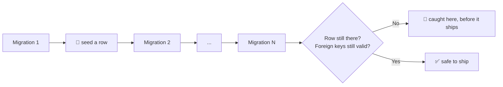

# migration-preflight

Test your database migrations before you ship them, not after they've already run on real data.

## The problem

A migration can look fine and still destroy data: dropping and recreating a table, renaming a
column, changing a type. None of that shows up against an empty local database. The same migration
can silently wipe real rows the moment it runs against a database that actually has data in it, and
by the time you find out, it already ran.

## The idea

Plant a row before the migration, run it, and check the row is still there and still correct after.
That's the difference between "it didn't crash" and "my data is safe."



One test run replays your entire migration history and tells you exactly which step, if any, would
have broken something.

## Quick start

```sh
pnpm add -D migration-preflight @migration-preflight/adapters-sqlite
```

```ts
import { createNodeSqliteMigrationDatabase } from "@migration-preflight/adapters-sqlite"; // or -postgres
import { MigrationChain } from "migration-preflight";
import { drizzleFileSource } from "migration-preflight/sources";

const migrations = drizzleFileSource(join(import.meta.dirname, "out"));
const chain = new MigrationChain(createNodeSqliteMigrationDatabase(), migrations);

await chain.applyThrough(migrations.at(-1)!.idx, () => []);
```

See the [Tutorial](./docs/tutorial.md) for seeding a row and proving it survives a migration.

## Packages

| Package                                                                                      | What it's for                 |
| -------------------------------------------------------------------------------------------- | ----------------------------- |
| [`migration-preflight`](./packages/migration-preflight)                                      | Core: replay engine, ports    |
| [`@migration-preflight/adapters-sqlite`](./packages/migration-preflight-adapters-sqlite)     | SQLite driver (`node:sqlite`) |
| [`@migration-preflight/adapters-postgres`](./packages/migration-preflight-adapters-postgres) | Postgres driver (PGlite)      |

The core has no database driver or ORM dependency. Add only the adapter for what you actually test.

## Known issue

Each `@electric-sql/pglite` instance is a full WASM-compiled Postgres, around 700MB+ peak RSS on its
own. The Postgres adapter's test suite works around this by sharing one instance across all its own
tests, but a project running many suites that each boot PGlite can still see high memory use in CI.

## Documentation

- [Tutorial](./docs/tutorial.md): seed a row, run a migration, prove it survives.
- [How-to guides](./docs/how-to.md): task recipes.
- [Reference](./docs/reference.md): API and package layout.
- [Explanation](./docs/explanation.md): design rationale.

## Contributing

```sh
pnpm install
pnpm verify
```

Released independently per package with [Changesets](https://github.com/changesets/changesets); see
[How-to § Release a new version](./docs/how-to.md#release-a-new-version).

## License

MIT
