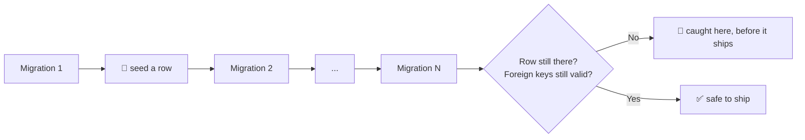

# 🚀 migration-preflight

<p align="center">
  
</p>

<div align="center">
  <b>Test your database migrations before you ship them, not after they've already run on real data.</b>
</div>

---

<div align="center">

<!-- Badges -->

<a href="https://opensource.org/licenses/MIT"></a>
<a href="https://pnpm.io/"></a>

<a href="https://www.typescriptlang.org/"></a>
<a href="https://nodejs.org">=22"></a>

<br/>
<a href="https://www.npmjs.com/package/migration-preflight"></a>
<a href="https://www.npmjs.com/package/@migration-preflight/adapters-sqlite"></a>
<a href="https://www.npmjs.com/package/@migration-preflight/adapters-postgres"></a>

</div>

---

## 🐛 The problem

A migration can drop and recreate a table, or rename a column by dropping the old one. It applies
cleanly, no error, and still destroys every row that was in it. An empty local database never
catches that: there's nothing in it to lose.

## 🌱 The idea

Plant a row before the migration, run it, and check the row survived. That's the difference between
"it didn't crash" and "my data is safe."



One test run replays your migration history and tells you exactly which step, if any, would have
broken something.

## ⚡ Quick start

```sh
pnpm add -D migration-preflight @migration-preflight/adapters-sqlite
```

```ts
import { createNodeSqliteMigrationDatabase } from "@migration-preflight/adapters-sqlite"; // or -postgres
import { MigrationChain, renderInsert } from "migration-preflight";
import { drizzleFileSource } from "migration-preflight/sources"; // or prismaFileSource, sqlFileSource

const migrations = drizzleFileSource(join(import.meta.dirname, "out"));
const chain = new MigrationChain(createNodeSqliteMigrationDatabase(), migrations);

// Seed a row before the risky migration, then check it survives every later one
await chain.applyThrough(migrations.at(-1)!.idx, (migration) =>
  migration.tag === "0000_create_users"
    ? [{ sql: renderInsert("users", { id: "u1", email: "a@b.com" }), params: [] }]
    : [],
);

await chain.hasRow("users", "u1"); // true, the row survived the whole history
```

See the [Tutorial](./docs/tutorial.md) to walk through this step by step.

## 📦 Packages

| Package                                                                                      | What it's for                 |
| -------------------------------------------------------------------------------------------- | ----------------------------- |
| [`migration-preflight`](./packages/migration-preflight)                                      | Core: replay engine, ports    |
| [`@migration-preflight/adapters-sqlite`](./packages/migration-preflight-adapters-sqlite)     | SQLite driver (`node:sqlite`) |
| [`@migration-preflight/adapters-postgres`](./packages/migration-preflight-adapters-postgres) | Postgres driver (PGlite)      |

No database driver or ORM dependency in the core. Add only the adapter you actually test against.
Ships with Drizzle, Prisma, and plain-SQL-file sources; anything else plugs in through a custom
`MigrationSource`, see
[How-to § Add a custom `MigrationSource`](./docs/how-to.md#add-a-custom-migrationsource).

## 📚 Documentation

- 🚀 **[Tutorial](./docs/tutorial.md)**: seed a row, run a migration, prove it survives.
- 🛠️ **[How-to guides](./docs/how-to.md)**: task recipes.
- 📖 **[Reference](./docs/reference.md)**: API and package layout.
- 💡 **[Explanation](./docs/explanation.md)**: design rationale.

## 🤝 Contributing

```sh
pnpm install
pnpm verify
```

Released independently per package with [Changesets](https://github.com/changesets/changesets); see
[How-to § Release a new version](./docs/how-to.md#release-a-new-version).

## License

MIT
