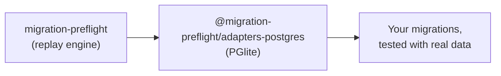

# 🐘 @migration-preflight/adapters-postgres

<p align="center">
  
</p>

<div align="center">
  <b>Test Postgres migrations against real data, no Docker, no external server.</b>
</div>

---

<div align="center">

<!-- Badges -->

<a href="https://opensource.org/licenses/MIT"></a>
<a href="https://www.typescriptlang.org/"></a>
<a href="https://nodejs.org">=22"></a>

<br/>
<a href="https://www.npmjs.com/package/@migration-preflight/adapters-postgres"></a>
<a href="https://www.npmjs.com/package/@migration-preflight/adapters-postgres"></a>

</div>

---

The Postgres driver for
[`migration-preflight`](https://github.com/arnaud-zg/migration-preflight/tree/main/packages/migration-preflight).
A migration that silently drops or corrupts data usually only fails once it meets real data, and by
then it already ran. This package is what lets that test run against Postgres.

Backed by [PGlite](https://pglite.dev), an in-memory WASM Postgres. No Docker, no external server,
no network. It boots in milliseconds.



## Install

```sh
pnpm add -D migration-preflight @migration-preflight/adapters-postgres
```

## Two entry points

So a consumer of the raw driver never has to install `drizzle-orm`:

| Import                                           | Use it for                                              |
| ------------------------------------------------ | ------------------------------------------------------- |
| `@migration-preflight/adapters-postgres`         | Seed-between-migrations tests, the one that matters     |
| `@migration-preflight/adapters-postgres/drizzle` | Quick "does the whole history apply cleanly" smoke test |

```ts
// Seed-between-migrations test
import { createPgliteMigrationDatabase } from "@migration-preflight/adapters-postgres";
// Quick smoke test
import { runDrizzlePgliteMigrations } from "@migration-preflight/adapters-postgres/drizzle";
```

## Usage

Works with any bundled migration source, Drizzle, Prisma, or plain SQL files:

```ts
import { createPgliteMigrationDatabase } from "@migration-preflight/adapters-postgres";
import { MigrationChain } from "migration-preflight";
import { drizzleFileSource, prismaFileSource, sqlFileSource } from "migration-preflight/sources";

const migrations = drizzleFileSource(join(import.meta.dirname, "out"));
// or: prismaFileSource(join(import.meta.dirname, "../prisma/migrations"))
// or: sqlFileSource(join(import.meta.dirname, "migrations"))

const chain = new MigrationChain(createPgliteMigrationDatabase(), migrations);

await chain.applyAll();
```

See
[How-to § Pick a migration source](https://github.com/arnaud-zg/migration-preflight/blob/main/docs/how-to.md#pick-a-migration-source)
for what each folder layout looks like.

## Foreign keys behave differently here than in SQLite

`foreignKeyViolations()` always returns `[]` on Postgres; a violation surfaces as a thrown error
from the `run`/`transaction` call that caused it instead. See
[Explanation](https://github.com/arnaud-zg/migration-preflight/blob/main/docs/explanation.md#why-foreignkeyviolations-always-returns--on-postgres)
for why, and
[How-to § Assert on foreign key integrity](https://github.com/arnaud-zg/migration-preflight/blob/main/docs/how-to.md#assert-on-foreign-key-integrity)
for how to test it.

## Postgres extensions (e.g. `pg_trgm`)

If a migration runs `CREATE EXTENSION ...`, PGlite needs that extension loaded up front, by building
the client yourself and passing it in. See
[How-to § Load Postgres extensions](https://github.com/arnaud-zg/migration-preflight/blob/main/docs/how-to.md#load-postgres-extensions-eg-pg_trgm)
for the recipe.

## Known issue: high memory use in tests

Each PGlite instance is a full WASM-compiled Postgres, roughly 700MB+ peak RSS on its own. See
[Explanation](https://github.com/arnaud-zg/migration-preflight/blob/main/docs/explanation.md#known-issue-pglite-memory-use-in-tests)
for why, and how this package's own test suite works around it.

## 📦 Packages

| Package                                                                                                                                           | What it's for                 |
| ------------------------------------------------------------------------------------------------------------------------------------------------- | ----------------------------- |
| [`migration-preflight`](https://github.com/arnaud-zg/migration-preflight/tree/main/packages/migration-preflight)                                  | Core: replay engine, ports    |
| [`@migration-preflight/adapters-sqlite`](https://github.com/arnaud-zg/migration-preflight/tree/main/packages/migration-preflight-adapters-sqlite) | SQLite driver (`node:sqlite`) |
| `@migration-preflight/adapters-postgres`                                                                                                          | Postgres driver (PGlite)      |

_`@migration-preflight/adapters-postgres` isn't linked above: that's this package._

## 📚 Documentation

- 🚀 **[Tutorial](https://github.com/arnaud-zg/migration-preflight/blob/main/docs/tutorial.md)**:
  seed a row, run a migration, prove it survives.
- 🛠️ **[How-to guides](https://github.com/arnaud-zg/migration-preflight/blob/main/docs/how-to.md)**:
  task recipes.
- 📖 **[Reference](https://github.com/arnaud-zg/migration-preflight/blob/main/docs/reference.md)**:
  API and package layout.
- 💡
  **[Explanation](https://github.com/arnaud-zg/migration-preflight/blob/main/docs/explanation.md)**:
  design rationale.

## Contributing

```bash
pnpm --filter @migration-preflight/adapters-postgres test:db        # run the test suite
pnpm --filter @migration-preflight/adapters-postgres typecheck      # type-check
pnpm --filter @migration-preflight/adapters-postgres lint           # eslint
```

## License

MIT
