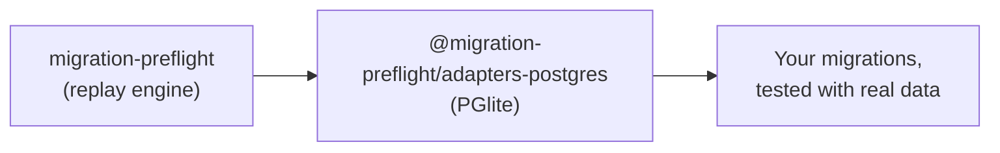

# @migration-preflight/adapters-postgres

The Postgres driver for [`migration-preflight`](../migration-preflight). A migration that silently
drops or corrupts data usually only fails once it meets real data, and by then it already ran. This
package is what lets that test run against Postgres.

Backed by [PGlite](https://pglite.dev), an in-memory WASM Postgres. No Docker, no external server,
no network. It boots in milliseconds.



## Install

```sh
pnpm add -D migration-preflight @migration-preflight/adapters-postgres
```

## Two entry points

So a consumer of the raw driver never has to install `drizzle-orm`:

| Import                                           | Use it for                                              |
| ------------------------------------------------ | ------------------------------------------------------- |
| `@migration-preflight/adapters-postgres`         | Seed-between-migrations tests, the one that matters     |
| `@migration-preflight/adapters-postgres/drizzle` | Quick "does the whole history apply cleanly" smoke test |

```ts
// Seed-between-migrations test
import { createPgliteMigrationDatabase } from "@migration-preflight/adapters-postgres";
// Quick smoke test
import { runDrizzlePgliteMigrations } from "@migration-preflight/adapters-postgres/drizzle";
```

## Usage

```ts
import { createPgliteMigrationDatabase } from "@migration-preflight/adapters-postgres";
import { MigrationChain } from "migration-preflight";
import { drizzleFileSource } from "migration-preflight/sources";

const migrations = drizzleFileSource(join(import.meta.dirname, "out"));
const chain = new MigrationChain(createPgliteMigrationDatabase(), migrations);

await chain.applyThrough(migrations.at(-1)!.idx, () => []);
```

## Foreign keys behave differently here than in SQLite

Postgres enforces foreign keys immediately, at write time, there's no deferred check to run
afterward like SQLite's `PRAGMA foreign_key_check`. So `foreignKeyViolations()` always returns `[]`
here; a violation shows up as a thrown error from the `run`/`transaction` call that caused it
instead.

## Postgres extensions (e.g. `pg_trgm`)

If a migration runs `CREATE EXTENSION ...`, PGlite needs that extension loaded up front. Build the
client yourself and pass it in, neither `runDrizzlePgliteMigrations` nor
`createPgliteMigrationDatabase` closes a client you supplied:

```ts
import { PGlite } from "@electric-sql/pglite";
import { pg_trgm } from "@electric-sql/pglite/contrib/pg_trgm";

const client = new PGlite({ extensions: { pg_trgm } });

// Drizzle-native apply-clean check
await runDrizzlePgliteMigrations({ migrationsFolder, client });
await client.close();

// Seed-between-migrations test, same idea
const db = createPgliteMigrationDatabase(new PGlite({ extensions: { pg_trgm } }));
```

## Known issue: high memory use in tests

Each PGlite instance is a full WASM-compiled Postgres, roughly 700MB+ peak RSS on its own. This
package's own test suite shares one instance across all its tests (`isolate: false`,
`fileParallelism: false` in `vitest.config.ts`) to pay that cost once. A consuming project that
boots several PGlite instances across parallel test files can still see high memory use,
particularly in CI with limited memory per runner.

See the [full documentation](../../docs/) for a tutorial, more recipes, and the API reference.

## Contributing

```bash
pnpm --filter @migration-preflight/adapters-postgres test:db        # run the test suite
pnpm --filter @migration-preflight/adapters-postgres typecheck      # type-check
pnpm --filter @migration-preflight/adapters-postgres lint           # eslint
```

## License

MIT
