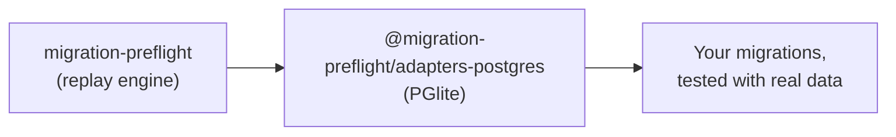

# @migration-preflight/adapters-postgres

<p align="center">
  
</p>

The Postgres driver for [`migration-preflight`](../migration-preflight). A migration that silently
drops or corrupts data usually only fails once it meets real data, and by then it already ran. This
package is what lets that test run against Postgres.

Backed by [PGlite](https://pglite.dev), an in-memory WASM Postgres. No Docker, no external server,
no network. It boots in milliseconds.



## Install

```sh
pnpm add -D migration-preflight @migration-preflight/adapters-postgres
```

## Two entry points

So a consumer of the raw driver never has to install `drizzle-orm`:

| Import                                           | Use it for                                              |
| ------------------------------------------------ | ------------------------------------------------------- |
| `@migration-preflight/adapters-postgres`         | Seed-between-migrations tests, the one that matters     |
| `@migration-preflight/adapters-postgres/drizzle` | Quick "does the whole history apply cleanly" smoke test |

```ts
// Seed-between-migrations test
import { createPgliteMigrationDatabase } from "@migration-preflight/adapters-postgres";
// Quick smoke test
import { runDrizzlePgliteMigrations } from "@migration-preflight/adapters-postgres/drizzle";
```

## Usage

```ts
import { createPgliteMigrationDatabase } from "@migration-preflight/adapters-postgres";
import { MigrationChain } from "migration-preflight";
import { drizzleFileSource } from "migration-preflight/sources";

const migrations = drizzleFileSource(join(import.meta.dirname, "out"));
const chain = new MigrationChain(createPgliteMigrationDatabase(), migrations);

await chain.applyThrough(migrations.at(-1)!.idx, () => []);
```

## Foreign keys behave differently here than in SQLite

`foreignKeyViolations()` always returns `[]` on Postgres; a violation surfaces as a thrown error
from the `run`/`transaction` call that caused it instead. See
[Explanation](../../docs/explanation.md#why-foreignkeyviolations-always-returns--on-postgres) for
why, and
[How-to § Assert on foreign key integrity](../../docs/how-to.md#assert-on-foreign-key-integrity) for
how to test it.

## Postgres extensions (e.g. `pg_trgm`)

If a migration runs `CREATE EXTENSION ...`, PGlite needs that extension loaded up front, by building
the client yourself and passing it in. See
[How-to § Load Postgres extensions](../../docs/how-to.md#load-postgres-extensions-eg-pg_trgm) for
the recipe.

## Known issue: high memory use in tests

Each PGlite instance is a full WASM-compiled Postgres, roughly 700MB+ peak RSS on its own. See
[Explanation](../../docs/explanation.md#known-issue-pglite-memory-use-in-tests) for why, and how
this package's own test suite works around it.

See the [full documentation](../../docs/) for a tutorial, more recipes, and the API reference.

## Contributing

```bash
pnpm --filter @migration-preflight/adapters-postgres test:db        # run the test suite
pnpm --filter @migration-preflight/adapters-postgres typecheck      # type-check
pnpm --filter @migration-preflight/adapters-postgres lint           # eslint
```

## License

MIT
