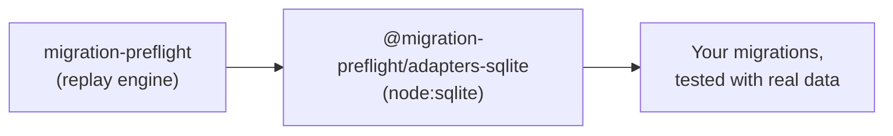

# @migration-preflight/adapters-sqlite

<p align="center">
  
</p>

The SQLite driver for [`migration-preflight`](../migration-preflight). A migration that silently
drops data usually only fails once it meets real data, and by then it already ran. This package is
what lets that test run against SQLite.

Zero runtime dependencies: `node:sqlite` is a Node builtin, so testing your SQLite migrations never
requires installing or configuring anything else.



## Install

```sh
pnpm add -D migration-preflight @migration-preflight/adapters-sqlite
```

## Two entry points

So a consumer of the raw driver never has to install `drizzle-orm` / `better-sqlite3`:

| Import                                         | Use it for                                              |
| ---------------------------------------------- | ------------------------------------------------------- |
| `@migration-preflight/adapters-sqlite`         | Seed-between-migrations tests, the one that matters     |
| `@migration-preflight/adapters-sqlite/drizzle` | Quick "does the whole history apply cleanly" smoke test |

```ts
// Seed-between-migrations test
import { createNodeSqliteMigrationDatabase } from "@migration-preflight/adapters-sqlite";
// Quick smoke test
import { runDrizzleBetterSqliteMigrations } from "@migration-preflight/adapters-sqlite/drizzle";
```

## Usage

```ts
import { createNodeSqliteMigrationDatabase } from "@migration-preflight/adapters-sqlite";
import { MigrationChain } from "migration-preflight";
import { drizzleFileSource } from "migration-preflight/sources";

const migrations = drizzleFileSource(join(import.meta.dirname, "out"));
const chain = new MigrationChain(createNodeSqliteMigrationDatabase(), migrations);

await chain.applyThrough(migrations.at(-1)!.idx, () => []);
```

No emulator, no device, no Docker, this runs in plain Node, as fast as any other test.

See the [full documentation](../../docs/) for a tutorial, more recipes, and the API reference.

## Contributing

```bash
pnpm --filter @migration-preflight/adapters-sqlite test        # run the test suite
pnpm --filter @migration-preflight/adapters-sqlite typecheck   # type-check
pnpm --filter @migration-preflight/adapters-sqlite lint        # eslint
```

## License

MIT
