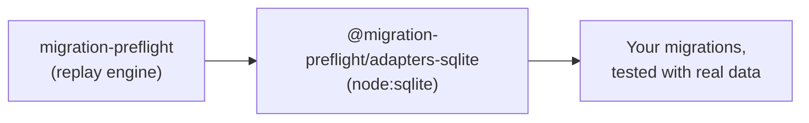

# 🪶 @migration-preflight/adapters-sqlite

<p align="center">
  
</p>

<div align="center">
  <b>Test SQLite migrations against real data, zero runtime dependencies.</b>
</div>

---

<div align="center">

<!-- Badges -->

<a href="https://opensource.org/licenses/MIT"></a>
<a href="https://www.typescriptlang.org/"></a>
<a href="https://nodejs.org">=22"></a>

<br/>
<a href="https://www.npmjs.com/package/@migration-preflight/adapters-sqlite"></a>
<a href="https://www.npmjs.com/package/@migration-preflight/adapters-sqlite"></a>

</div>

---

The SQLite driver for
[`migration-preflight`](https://github.com/arnaud-zg/migration-preflight/tree/main/packages/migration-preflight).
A migration that silently drops data usually only fails once it meets real data, and by then it
already ran. This package is what lets that test run against SQLite.

Zero runtime dependencies: `node:sqlite` is a Node builtin, so testing your SQLite migrations never
requires installing or configuring anything else.



## Install

```sh
pnpm add -D migration-preflight @migration-preflight/adapters-sqlite
```

## Two entry points

So a consumer of the raw driver never has to install `drizzle-orm` / `better-sqlite3`:

| Import                                         | Use it for                                              |
| ---------------------------------------------- | ------------------------------------------------------- |
| `@migration-preflight/adapters-sqlite`         | Seed-between-migrations tests, the one that matters     |
| `@migration-preflight/adapters-sqlite/drizzle` | Quick "does the whole history apply cleanly" smoke test |

```ts
// Seed-between-migrations test
import { createNodeSqliteMigrationDatabase } from "@migration-preflight/adapters-sqlite";
// Quick smoke test
import { runDrizzleBetterSqliteMigrations } from "@migration-preflight/adapters-sqlite/drizzle";
```

## Usage

Works with any bundled migration source, Drizzle, Prisma, or plain SQL files:

```ts
import { createNodeSqliteMigrationDatabase } from "@migration-preflight/adapters-sqlite";
import { MigrationChain } from "migration-preflight";
import { drizzleFileSource, prismaFileSource, sqlFileSource } from "migration-preflight/sources";

const migrations = drizzleFileSource(join(import.meta.dirname, "out"));
// or: prismaFileSource(join(import.meta.dirname, "../prisma/migrations"))
// or: sqlFileSource(join(import.meta.dirname, "migrations"))

const chain = new MigrationChain(createNodeSqliteMigrationDatabase(), migrations);

await chain.applyAll();
```

No emulator, no device, no Docker, this runs in plain Node, as fast as any other test. See
[How-to § Pick a migration source](https://github.com/arnaud-zg/migration-preflight/blob/main/docs/how-to.md#pick-a-migration-source)
for what each folder layout looks like.

## 📦 Packages

| Package                                                                                                                                               | What it's for                 |
| ----------------------------------------------------------------------------------------------------------------------------------------------------- | ----------------------------- |
| [`migration-preflight`](https://github.com/arnaud-zg/migration-preflight/tree/main/packages/migration-preflight)                                      | Core: replay engine, ports    |
| `@migration-preflight/adapters-sqlite`                                                                                                                | SQLite driver (`node:sqlite`) |
| [`@migration-preflight/adapters-postgres`](https://github.com/arnaud-zg/migration-preflight/tree/main/packages/migration-preflight-adapters-postgres) | Postgres driver (PGlite)      |

_`@migration-preflight/adapters-sqlite` isn't linked above: that's this package._

## 📚 Documentation

- 🚀 **[Tutorial](https://github.com/arnaud-zg/migration-preflight/blob/main/docs/tutorial.md)**:
  seed a row, run a migration, prove it survives.
- 🛠️ **[How-to guides](https://github.com/arnaud-zg/migration-preflight/blob/main/docs/how-to.md)**:
  task recipes.
- 📖 **[Reference](https://github.com/arnaud-zg/migration-preflight/blob/main/docs/reference.md)**:
  API and package layout.
- 💡
  **[Explanation](https://github.com/arnaud-zg/migration-preflight/blob/main/docs/explanation.md)**:
  design rationale.

## Contributing

```bash
pnpm --filter @migration-preflight/adapters-sqlite test        # run the test suite
pnpm --filter @migration-preflight/adapters-sqlite typecheck   # type-check
pnpm --filter @migration-preflight/adapters-sqlite lint        # eslint
```

## License

MIT
