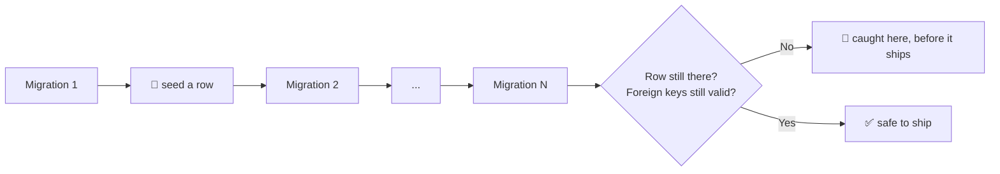

# 🚀 migration-preflight

<p align="center">
  
</p>

<div align="center">
  <b>Test your database migrations before you ship them, not after they've already run on real data.</b>
</div>

---

<div align="center">

<!-- Badges -->

<a href="https://opensource.org/licenses/MIT"></a>
<a href="https://www.typescriptlang.org/"></a>
<a href="https://nodejs.org">=22"></a>
 <br/>
<a href="https://www.npmjs.com/package/migration-preflight"></a>
<a href="https://www.npmjs.com/package/migration-preflight"></a>

</div>

---

## The problem

A migration can look fine and still destroy data: dropping and recreating a table, renaming a
column, changing a type. None of that shows up against an empty local database. The same migration
can silently wipe real rows the moment it runs against a database that actually has data in it, and
by the time you find out, it already ran.

## The idea

Plant a row before the migration, run it, and check the row is still there and still correct after.
That's the difference between "it didn't crash" and "my data is safe."



One test run replays your entire migration history and tells you exactly which step, if any, would
have broken something.

## Quick start

```sh
pnpm add -D migration-preflight @migration-preflight/adapters-sqlite
```

```ts
import { createNodeSqliteMigrationDatabase } from "@migration-preflight/adapters-sqlite"; // or -postgres
import { MigrationChain } from "migration-preflight";
import { drizzleFileSource } from "migration-preflight/sources";

const migrations = drizzleFileSource(join(import.meta.dirname, "out"));
const chain = new MigrationChain(createNodeSqliteMigrationDatabase(), migrations);

await chain.applyThrough(migrations.at(-1)!.idx, () => []);
```

The payoff, catching a migration that silently drops data, comes from seeding a row between two
migrations. See [Seeding between migrations](#seeding-between-migrations) below.

## 📦 Packages

This package is the dialect-agnostic core: the replay engine and the ports it runs against. No
database driver, no ORM dependency.

| Package                                                                                                                                               | What it's for                 |
| ----------------------------------------------------------------------------------------------------------------------------------------------------- | ----------------------------- |
| `migration-preflight`                                                                                                                                 | Core: replay engine, ports    |
| [`@migration-preflight/adapters-sqlite`](https://github.com/arnaud-zg/migration-preflight/tree/main/packages/migration-preflight-adapters-sqlite)     | SQLite driver (`node:sqlite`) |
| [`@migration-preflight/adapters-postgres`](https://github.com/arnaud-zg/migration-preflight/tree/main/packages/migration-preflight-adapters-postgres) | Postgres driver (PGlite)      |

_`migration-preflight` isn't linked above: that's this package._

## Seeding between migrations

A seed is a row tagged with the migration it goes in right after, a test fixture only, never
imported by production code. `applyThrough` runs it in place after that migration, so you can assert
the row is still correct once every later migration has run:

```ts
import { renderInsert } from "migration-preflight";

await chain.applyThrough(migrations.at(-1)!.idx, (migration) =>
  migration.tag === "0000_create_users"
    ? [{ sql: renderInsert("users", { id: "u1", email: "a@b.com" }), params: [] }]
    : [],
);

// Still there after every later migration ran? Then this migration history is safe.
expect(await chain.hasRow("users", "u1")).toBe(true);
expect(await chain.foreignKeyViolations()).toEqual([]);
```

Seeding more than one row gets unwieldy as a chain of `migration.tag === ...` checks. See
[How-to § Seed a row between migrations](https://github.com/arnaud-zg/migration-preflight/blob/main/docs/how-to.md#seed-a-row-between-migrations)
for the recipe that scales: seeds as data, filtered by tag.

## Integrating with Drizzle, Prisma, plain SQL, and Postgres

`migration-preflight` itself only knows the `MigrationSource`, `MigrationDatabase`, and `SqlDialect`
ports. Concrete support comes from two other packages, plus three bundled sources:

- **`drizzleFileSource`**, **`prismaFileSource`**, **`sqlFileSource`** (all from
  `migration-preflight/sources`) each read a different migrations layout, Drizzle's journal,
  Prisma's `migrations/` folder, or a flat folder of `.sql` files, into the `Migration[]` this
  package replays.
- **`@migration-preflight/adapters-sqlite`** and **`@migration-preflight/adapters-postgres`** each
  supply a `MigrationDatabase` and, behind a `/drizzle` subpath, a thin wrapper over Drizzle's own
  migrator for a quick "does it apply cleanly" check.

## 📚 Documentation

- 🚀 **[Tutorial](https://github.com/arnaud-zg/migration-preflight/blob/main/docs/tutorial.md)**:
  seed a row, run a migration, prove it survives.
- 🛠️ **[How-to guides](https://github.com/arnaud-zg/migration-preflight/blob/main/docs/how-to.md)**:
  task recipes.
- 📖 **[Reference](https://github.com/arnaud-zg/migration-preflight/blob/main/docs/reference.md)**:
  API and package layout.
- 💡
  **[Explanation](https://github.com/arnaud-zg/migration-preflight/blob/main/docs/explanation.md)**:
  design rationale.

## Contributing

```bash
pnpm --filter migration-preflight test        # run the test suite
pnpm --filter migration-preflight typecheck   # type-check
pnpm --filter migration-preflight lint        # eslint
```

No database, no network, no setup, everything here runs in plain Node.

## License

MIT
